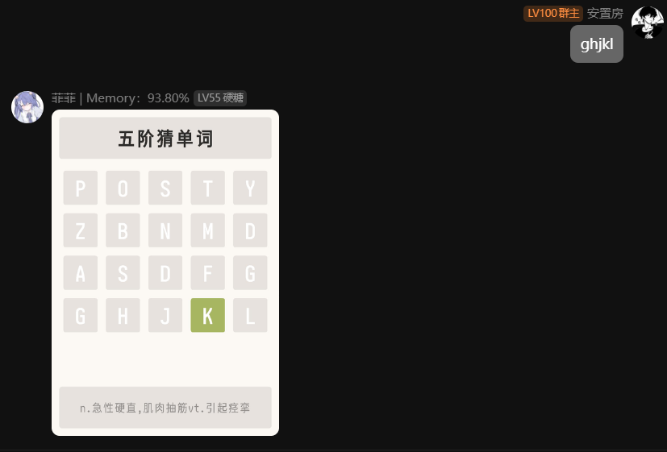

# 猜单词小游戏

由kotlin编写，基于miraiQQ机器人的插件

| 命令      | 解释              |
|---------|-----------------|
| 猜单词     | 随机阶猜单词          |
| N阶猜单词   | 猜字数为N阶段的单词 最大为9 |
| 十以上阶猜单词 | 猜字数为十以上阶段的单词    |
| 换词      | 换当前阶段的词         |
| 我认输     | 认输当前的单词         |
| 猜词条     | 猜我的世界词条         |
| 猜中文词条   | 根据我的世界英文猜中文     |
| 猜英文词条   | 根据我的世界中文猜英文     |
| ...     | 暂无              |

## 使用时请将data中的词库放到mirai主目录data目录下