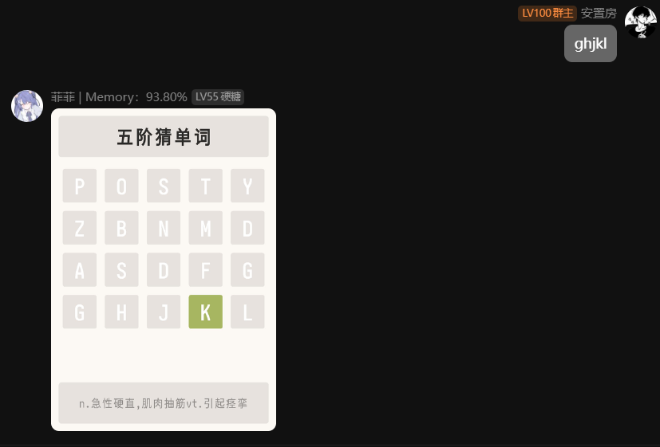

# 猜单词小游戏

由kotlin编写，基于miraiQQ机器人的插件

| 命令      | 解释              |
|---------|-----------------|
| 猜单词     | 随机阶猜单词          |
| N阶猜单词   | 猜字数为N阶段的单词 最大为9 |
| 十以上阶猜单词 | 猜字数为十以上阶段的单词    |
| 换词      | 换当前阶段从词         |
| ...     | 暂无              |

使用时请将data中的词库放到mirai主目录data目录下